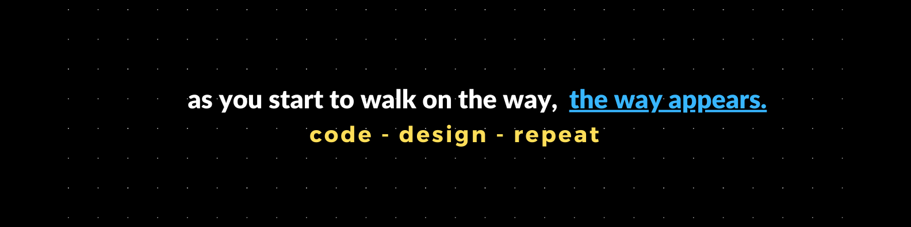

<h1 align="center">Hi 👋, I'm Sundeep Basak</h1>
<h3 align="center">A passionate frontend developer from India from India</h3>

- 🌱 I’m currently learning **React and building projects with it.**

- 📫 How to reach me **sundeep15basak@gmail.com**

<h3 align="left">Connect with me:</h3>

<h3 align="left">Languages and Tools:</h3>

  

